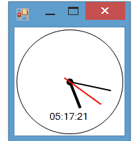

# Analog Clock Example

In this example, I've created a control which shows an analog clock. To draw the analog clock, I've overrided `OnPaint` method of the control, then by some simple math calculation, I've rotated the graphics object and drew clock hands.

To make the hands moving, I used a timer with interval set to 1000. Then in `Tick` event of the timer, `Invalidat` method of the control is called to make the control redraw itself.

